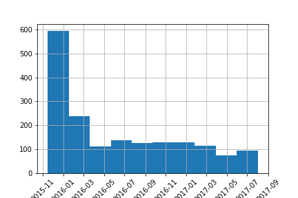
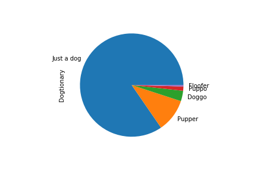
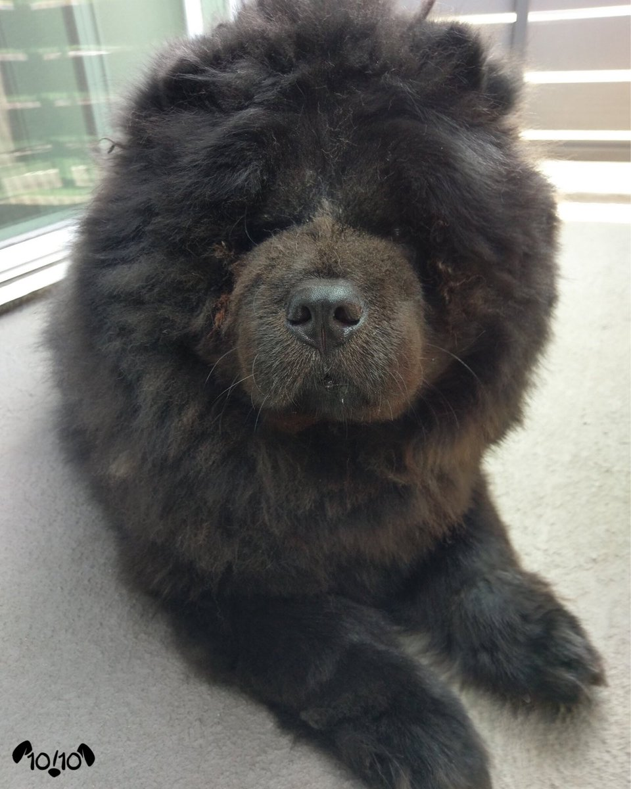
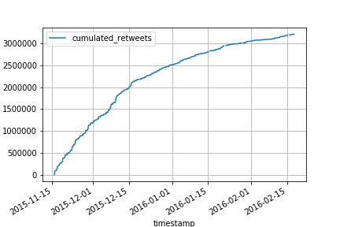
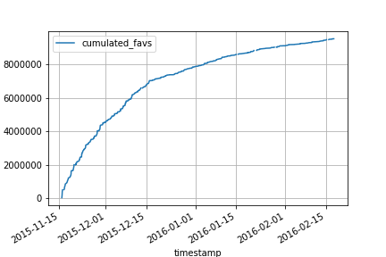
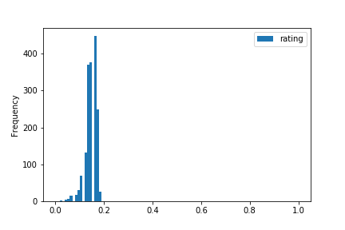
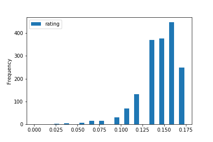
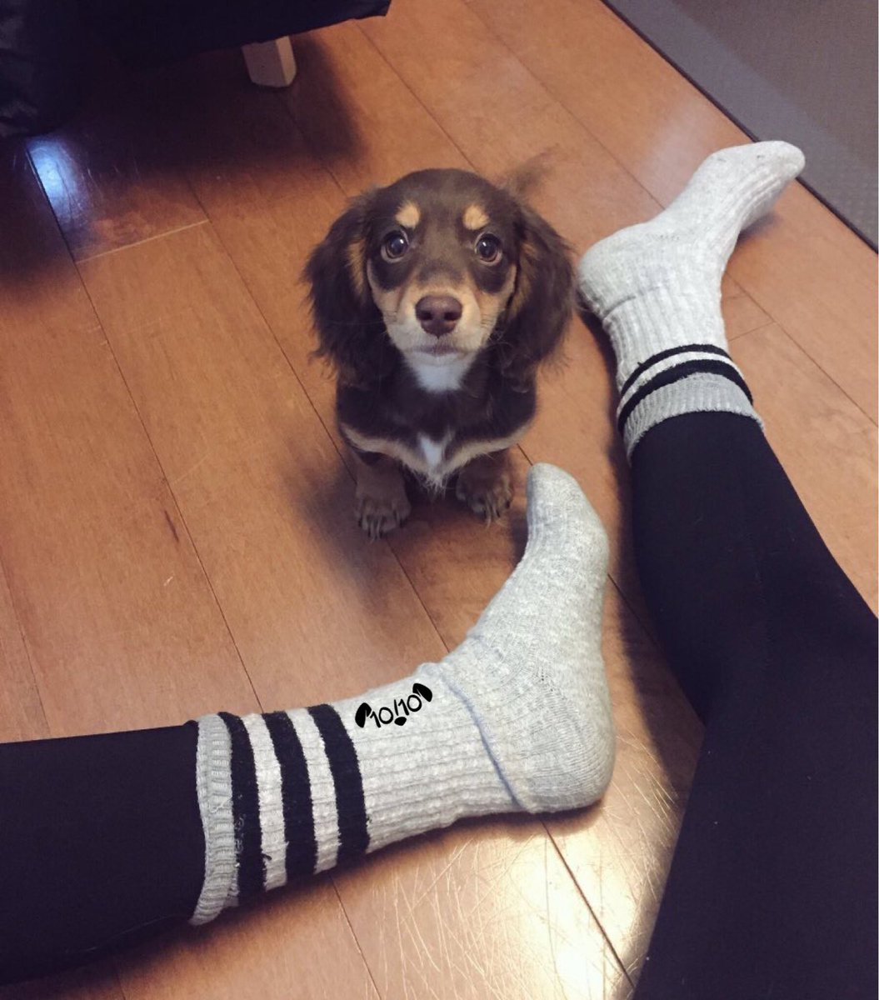
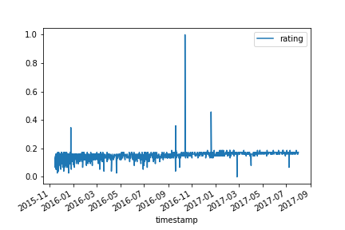

# "We rate Dogs" Analysis Report

As part of a [Udacity](www.udacity.com) Data Analyst Nanodegree I analyzed a Twitter account:
*We Rape Dogs!*, no pardon, [We Rate Dogs!](https://twitter.com/dog_rates).

We rate dogs is a popular Twitter account posting funny pictures and ratings about dogs. I
want to analyze the coverage of that account.

The dataset used spans from End of 2015 to Summer 2017:

The figure above shows the amount of tweets from that account in the considered time frame and
it can be seen, that the were more active in late 2015.

The dog jury of *We rate Dogs* has their own vocabulary in naming different types of dogs, like
'doggo' or 'pupper'.

In the dataset given, they used it in around a quarter of occasions:

Most of the dogs remained untyped, but around a sixth was classified as a 'Pupper' and the least
amount of dogs were 'Floofers'.

Here are two examples for 'Puppers':

 

 

And here one example for a fluffer

 

## Coverage

In total the account generated over 10.000.000 retweets and favs, with a higher momentum in the
earlier time span:

 

 

Another interesting fact within the twitter account of we rate dots, are their (name giving)
Dog Rates. They mostly rate dogs within a "... out of ten scale", so for example 8/10, or 4/10.
But sometimes a dog receives only a top note, and on other times the nominator may be higher
than 10, so for example 14/10.

Therefore I normalized all values to be within (0, 1) and also aded a denominator of 10,
wherever it was missing:

 

 

So now it is clear, that there are only a few outliers, namely those four guys. If you are a
dog person, brace for a cuteness impact:

Maybe as a last annotation it is woth noting, that the cuteness of the dogs increases slightly
over time:

so it might be interesting to stay tuned and follow that twitter
[account](https://twitter.com/dog_rates), if you are a dog person!
